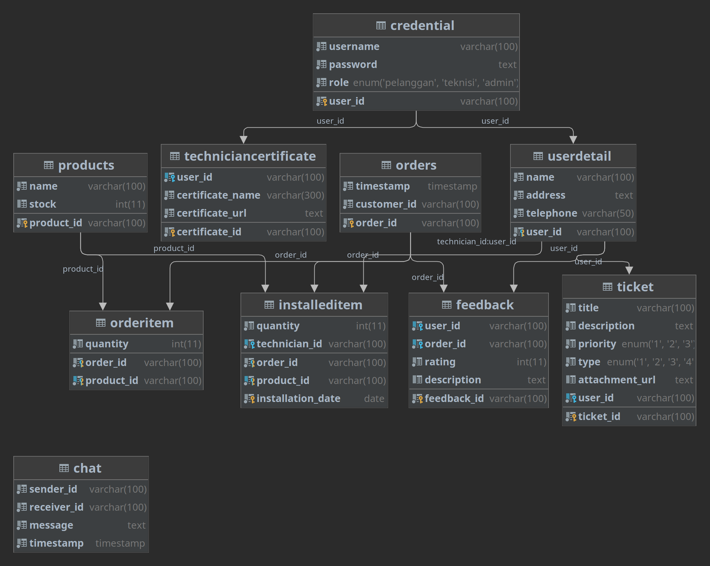
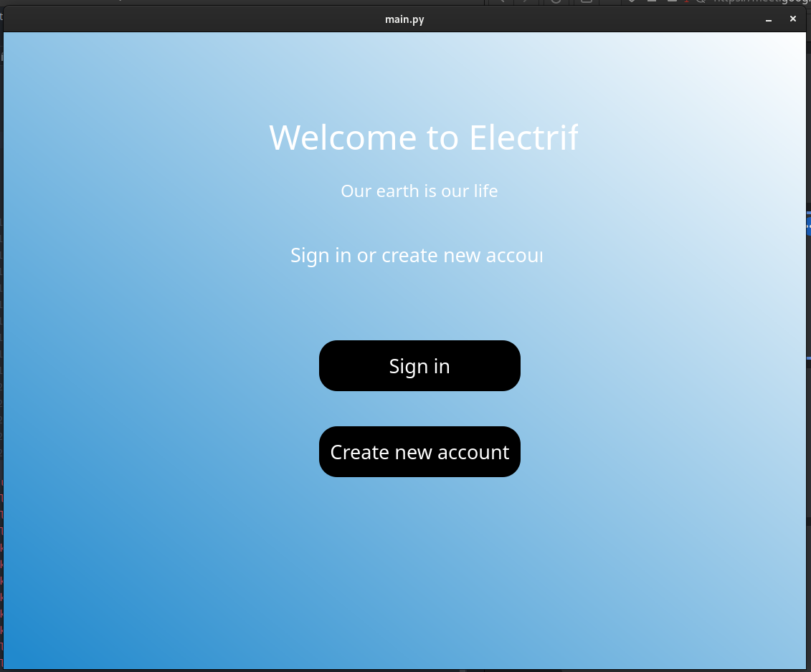
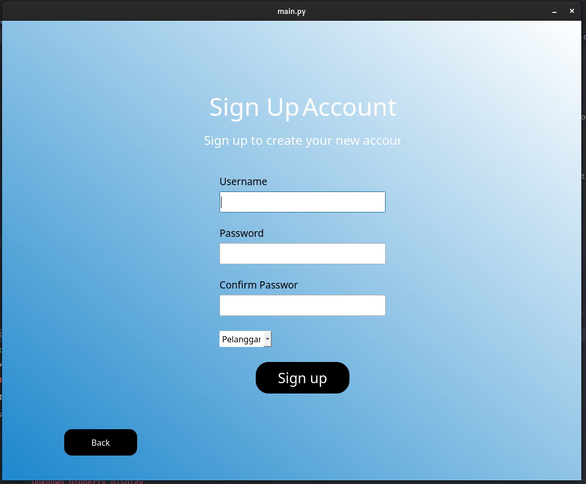
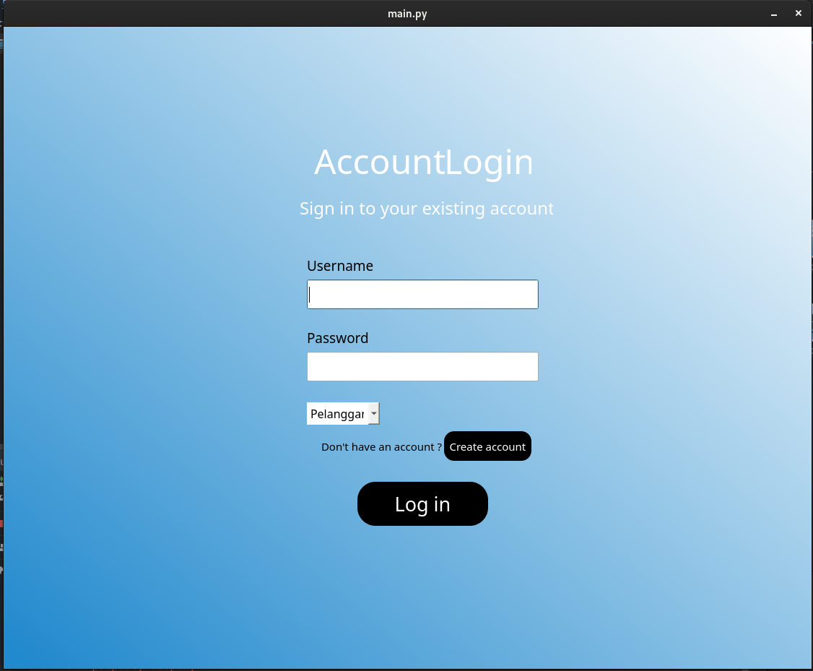
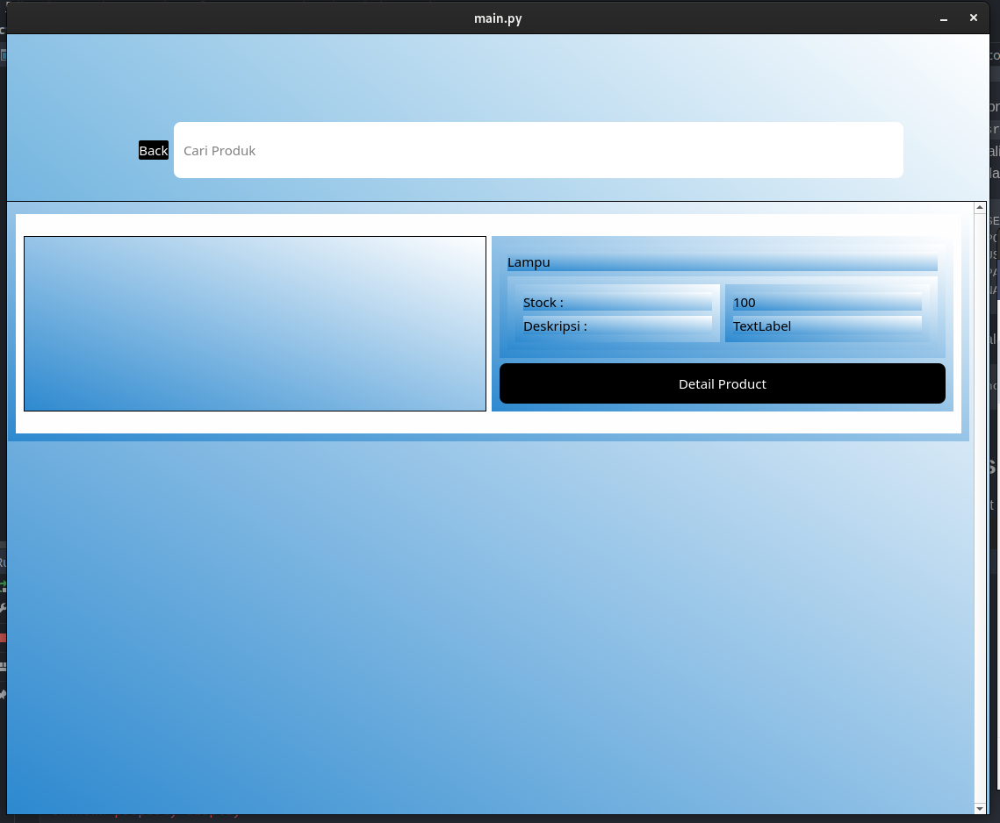
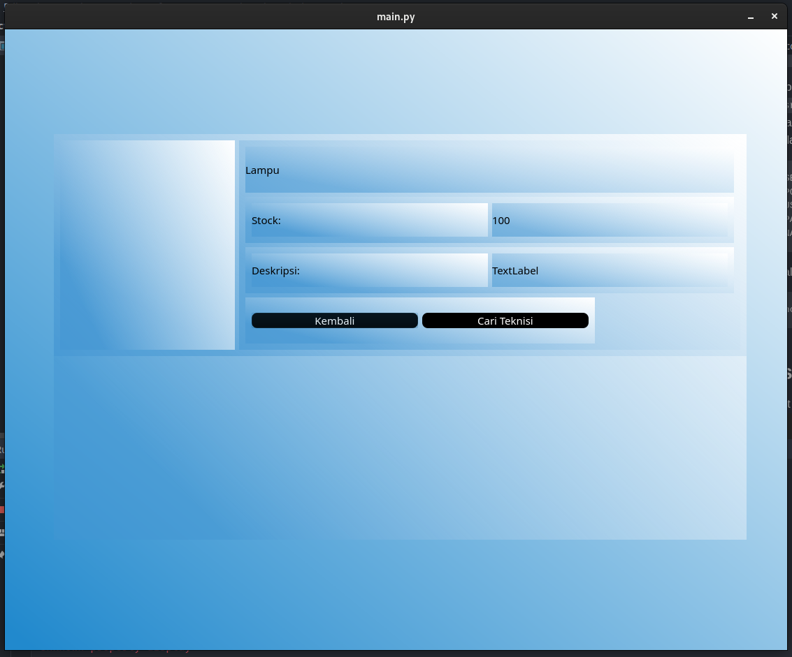
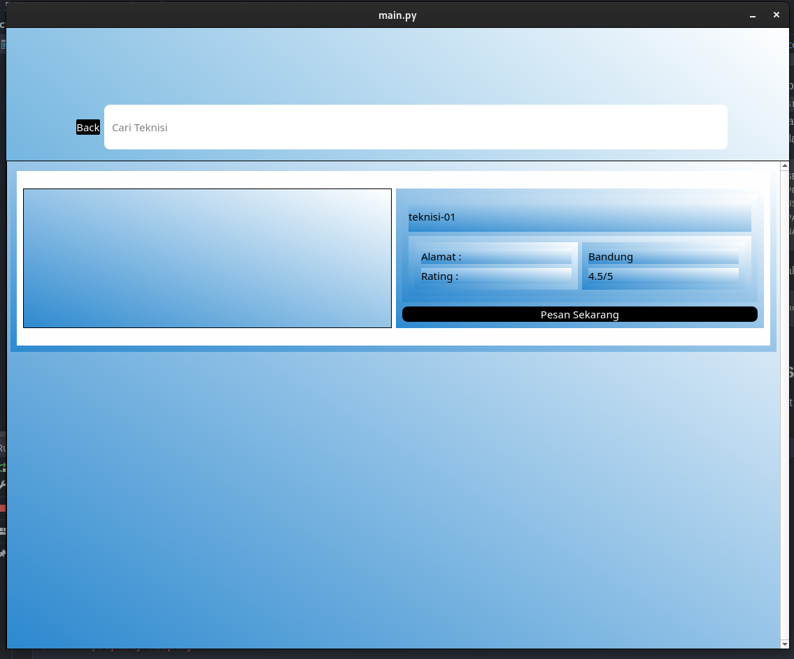
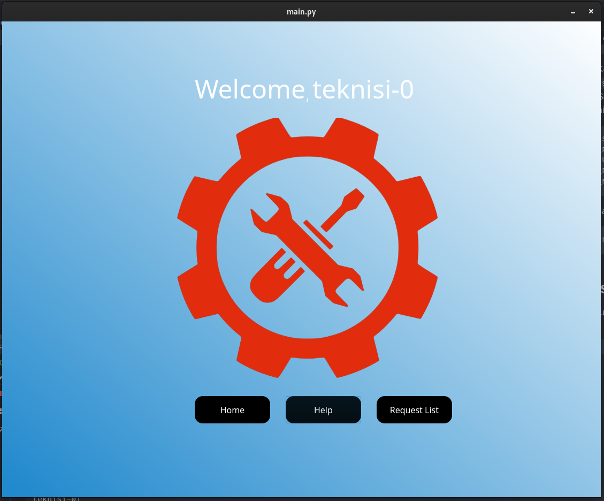
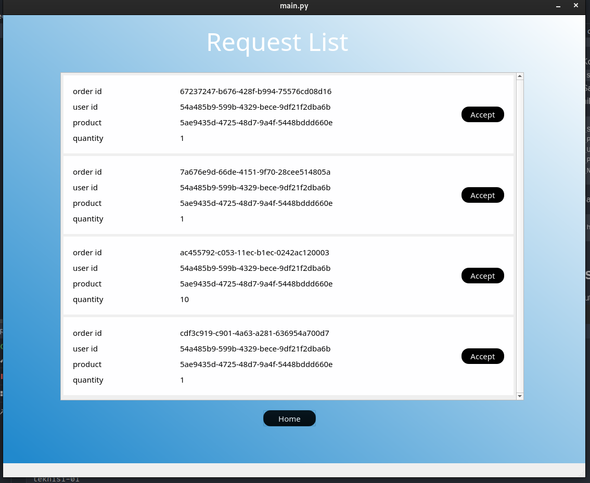
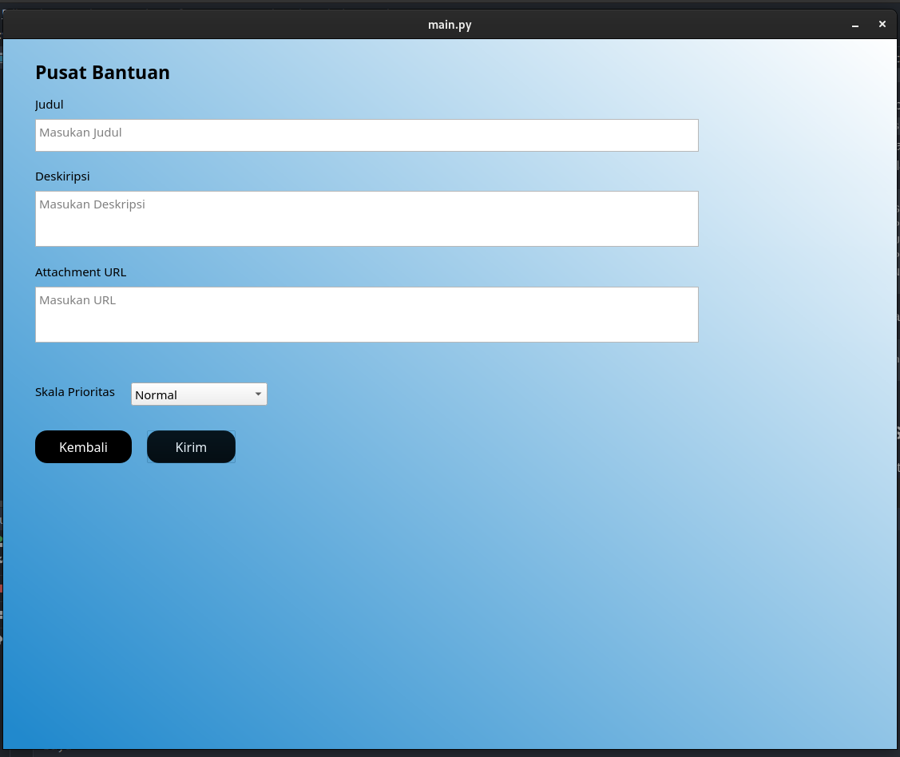

# Electrify

Electrify merupakan aplikasi digital berbasis desktop yang dibuat untuk 
menjawab kebutuhan energi bersih di dunia. Electrify dapat digunakan pelanggan
untuk mengelola PLTS-nya sendiri serta melihat keuntungan yang didapatkan dari
pemasangan PLTS. Aplikasi ini juga dapat berperan sebagai penghubung antara
pelanggan dengan para teknisi untuk melakukan pemasangan, perbaikan, serta
pencabutan panel surya.

## Requirement Sistem

Untuk menjalankan aplikasi ini, diperlukan kebutuhan sistem sebagai berikut:
* Python 3.10
* Python pip
* Mariadb Server

## Menjalankan aplikasi

Untuk menjalankan aplikasi ini, anda melakukan langkah berikut: 
1. Install Dependencies dari aplikasi. Anda dapat menjalankan perintah berikut:
```shell
pip install -r requirements.txt
```
2. Konfigurasikan database mariadb anda. Jalankan dump file SQL pada `src/dump/electrify.sql`
3. Salin file `config.example.py` menjadi file `config.py` pada folder  `src/database`. Ubahlah nilai berikut.
```python
DB_SERVER="<IP Server Anda>"
DB_PORT="<Port Server>"
DB_USERNAME="<Username>"
DB_PASSWORD="<Password>"
DB_NAME="<Nama Database>"
```
4. Jalankan aplikasi dengan perintah berikut
```shell
python src/main.py
```

## Desain Basis Data
Berikut ini adalah desain basis data pada aplikasi ini ini:


## Tampilan Aplikasi
Berikut ini adalah tampilan dari aplikasi ini:











## Authors

Proyek ini dibuat oleh:

* 13520116 Mahesa Lizardy
* 13520128 Bayu Samudra
* 13520137 Muhammad Gilang Ramadhan
* 13520165 Ghazian Tsabit Alkamil
